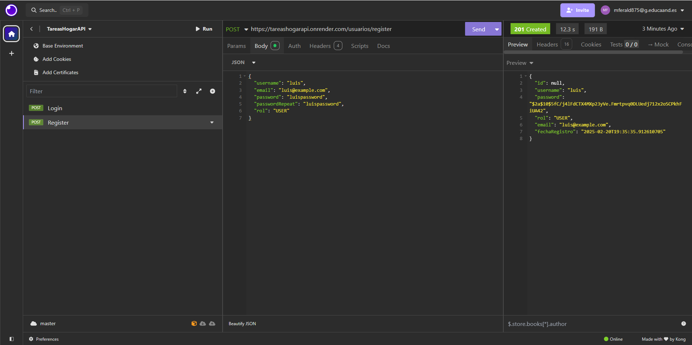

# API REST Segura - TareasHogarAPI

## 1. Información General

### a. Nombre del Proyecto
API REST Segura - TareasHogarAPI

### b. Descripción de los Documentos (Entidades) y sus Campos

#### Usuario
- **username:** Cadena única que identifica al usuario.
- **password:** Contraseña hasheada.
- **roles:** Rol(es) asignados al usuario (por ejemplo, USER o ADMIN).
- **Campos opcionales:** email, fecha de registro, etc.

#### Tarea
- **id:** Identificador único de la tarea.
- **titulo:** Título breve de la tarea.
- **descripcion:** Descripción detallada de la tarea.
- **estado:** Estado de la tarea (por ejemplo, PENDIENTE o COMPLETADA).
- **usuario:** Referencia al usuario propietario de la tarea.

#### Dirección
- **id:** Identificador único de la dirección.
- **calle:** Nombre de la calle.
- **numero:** Número de la dirección.
- **ciudad:** Ciudad.
- **codigoPostal:** Código postal.
- **usuario:** Referencia al usuario al que pertenece la dirección.

---

## 2. Endpoints y Descripción de Cada uno

### Usuarios
- **POST /api/auth/login**  
  **Descripción:** Autentica al usuario. Se envían las credenciales (username y password) y, de ser correctas, se devuelve un token JWT para autorizar futuras solicitudes.

- **POST /api/auth/register**  
  **Descripción:** Permite el registro de un nuevo usuario. Se envían los datos necesarios (username, password, etc.) y se almacena el usuario con la contraseña hasheada.

- **GET /api/usuarios**  
  **Descripción:** Devuelve la lista de todos los usuarios (getAll). Este endpoint suele estar restringido a usuarios con rol ADMIN.

- **GET /api/usuarios/{id}**  
  **Descripción:** Devuelve la información de un usuario específico (get).

- **PUT /api/usuarios/{id}**  
  **Descripción:** Actualiza la información de un usuario (update). El usuario podrá actualizar sus propios datos o, en el caso de un ADMIN, actualizar la información de cualquier usuario.

- **DELETE /api/usuarios/{id}**  
  **Descripción:** Elimina un usuario. (Este endpoint se puede implementar para administración, si es necesario).

### Tareas
- **GET /api/tareas**  
  **Descripción:**
  - Para usuario con rol USER: Devuelve únicamente las tareas asociadas al usuario autenticado (getAll).
  - Para usuario con rol ADMIN: Devuelve todas las tareas de la aplicación.

- **GET /api/tareas/{id}**  
  **Descripción:** Devuelve una tarea específica (get).

- **POST /api/tareas**  
  **Descripción:**
  - Para usuario con rol USER: Permite dar de alta una nueva tarea que se asociará automáticamente al usuario autenticado.
  - Para usuario con rol ADMIN: Permite crear una tarea y asignarla a cualquier usuario especificado en la solicitud.

- **PUT /api/tareas/{id}**  
  **Descripción:** Actualiza la información de una tarea (update). Se pueden modificar campos como título, descripción o estado (excepto la acción de “completar”, que tiene un endpoint específico).

- **PUT /api/tareas/{id}/completar**  
  **Descripción:** Marca una tarea como completada.  
  **Restricción:** El usuario solo puede completar sus propias tareas, a menos que sea administrador.

- **DELETE /api/tareas/{id}**  
  **Descripción:** Elimina una tarea.  
  **Restricción:** El usuario solo puede eliminar sus propias tareas, mientras que un administrador puede eliminar cualquier tarea.

### Direcciones
- **GET /api/direcciones**  
  **Descripción:** Devuelve la lista de todas las direcciones (getAll). La visibilidad de este endpoint dependerá de la política de acceso (por ejemplo, solo ADMIN o el usuario propietario).

- **GET /api/direcciones/{id}**  
  **Descripción:** Devuelve una dirección específica (get).

- **GET /api/direcciones/usuario/{usuarioId}**  
  **Descripción:** Devuelve la dirección asociada a un usuario determinado. (Alternativa para obtener la dirección por el id del usuario.)

- **POST /api/direcciones**  
  **Descripción:** Permite dar de alta una dirección para un usuario. La dirección se asocia al usuario indicado.

- **PUT /api/direcciones/{id}**  
  **Descripción:** Actualiza la información de una dirección (update).

- **DELETE /api/direcciones/{id}**  
  **Descripción:** Elimina una dirección. (Este endpoint se puede implementar para administración o para que el propio usuario elimine su dirección.)

---

## 3. Lógica de Negocio

### Registro y Autenticación
- Se implementa mediante endpoints dedicados.
- Las contraseñas se almacenan de forma hasheada.
- Tras una autenticación exitosa, se genera y devuelve un token JWT para mantener la sesión.

### Gestión de Tareas
- Los usuarios pueden crear, consultar, marcar como completadas y eliminar sus propias tareas.
- Los administradores tienen la capacidad de ver y eliminar cualquier tarea, y pueden asignar tareas a cualquier usuario.
- Al crear una tarea, se valida que el usuario autenticado tenga los permisos adecuados (solo puede asignar tareas a sí mismo si es usuario, o a cualquier usuario si es administrador).

### Validaciones y Restricciones
- Se comprueba que los usuarios no puedan manipular recursos que no les pertenecen.
- Las solicitudes se validan tanto a nivel de datos (por ejemplo, formatos correctos) como a nivel de permisos.

---

## 4. Manejo de Excepciones y Códigos de Estado

- **400 Bad Request:**  
  Se retorna cuando la solicitud tiene errores en los datos enviados o está mal formada.

- **401 Unauthorized:**  
  Se utiliza cuando el usuario no está autenticado o el token JWT es inválido o ha expirado.

- **403 Forbidden:**  
  Se devuelve cuando el usuario autenticado intenta acceder a un recurso o realizar una acción para la cual no tiene permisos (por ejemplo, un usuario intentando eliminar una tarea de otro usuario).

- **404 Not Found:**  
  Se emplea cuando se solicita un recurso que no existe (por ejemplo, una tarea o usuario inexistente).

- **500 Internal Server Error:**  
  Se utiliza para errores inesperados en el servidor.

---

## 5. Restricciones de Seguridad

### Autenticación y Autorización
- Se utiliza Spring Security para proteger los endpoints de la API.
- Se implementa JWT para gestionar la sesión y verificar la identidad del usuario en cada solicitud.
- Se utiliza un esquema de cifrado asimétrico (clave pública/privada) para asegurar la comunicación y la verificación de tokens.

### Control de Acceso a Endpoints
- Los endpoints de autenticación (`/api/auth/login` y `/api/auth/register`) son accesibles sin autenticación.
- Todos los demás endpoints requieren un token JWT válido.
- Los usuarios con rol USER solo pueden acceder y modificar sus propios recursos (tareas y direcciones).
- Los usuarios con rol ADMIN tienen permisos para acceder y modificar todos los recursos.

### Validación de Datos y Auditoría
- Se implementan validaciones en el servidor para asegurar la integridad y formato correcto de los datos.
- Se registran los intentos de acceso no autorizado y se lleva un registro de auditoría para el análisis y seguimiento de posibles incidencias de seguridad.

---

## 6. PRUEBAS GESTIÓN USUARIOS

### Registro de usuarios

- Pruebas de ejemplo de registrar un usuario de exitosamente.

- Pruebas de ejemplo de error al registrar un usuario con el mismo username.

- Pruebas de ejemplo de error al registrar un usuario sin validar la contraseña correctamente.

### Login de usuarios

- Se logea un usuario correctamente, lo que hace que devuelva un token.

- Se intenta logear con una contraseña incorrecta.

- Se intenta logear con un usuario no registrado en la BBDD.

### Gestión de usuarios con interfaz

- Se introducen los datos para registar un usuario en la interfaz y le damos a register.

- Vamos a la BBDD MongoDB y comprobamos que el usuario se ha registrado correctamente.

- Introducimos en la interfaz los datos de un usuario registrado, al hacer esto la interfaz nos devolverá un token.

